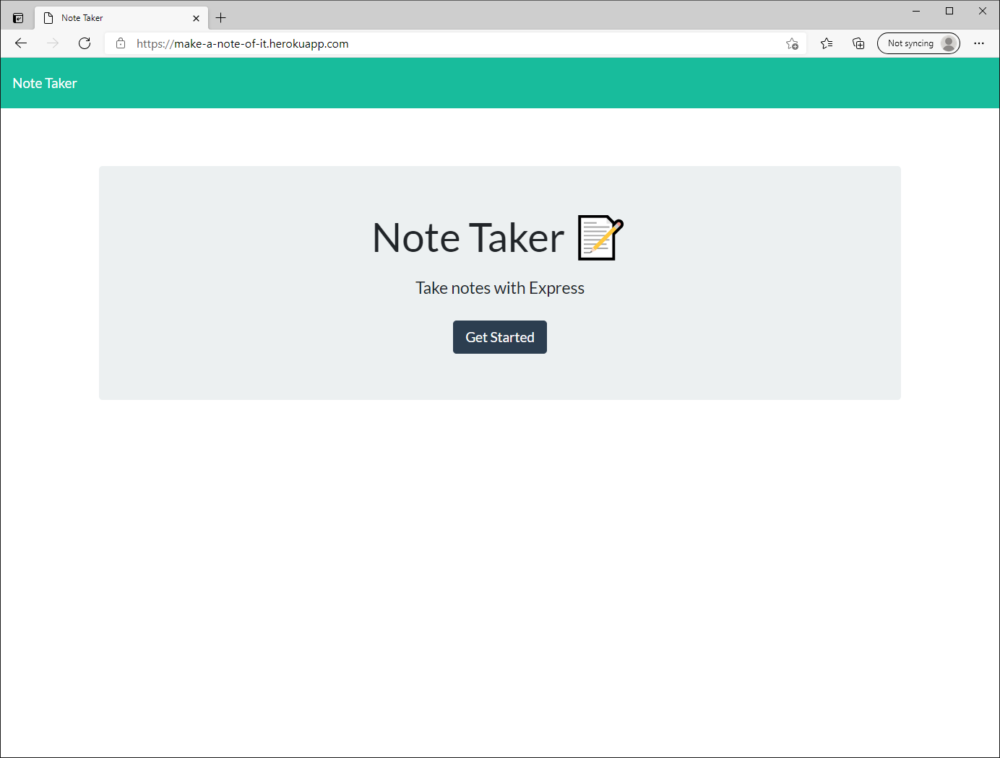
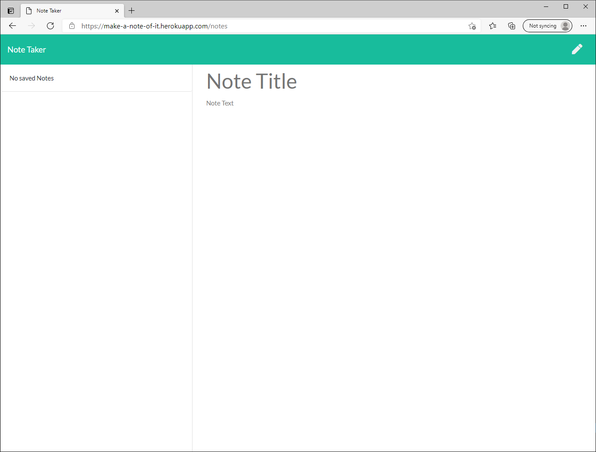
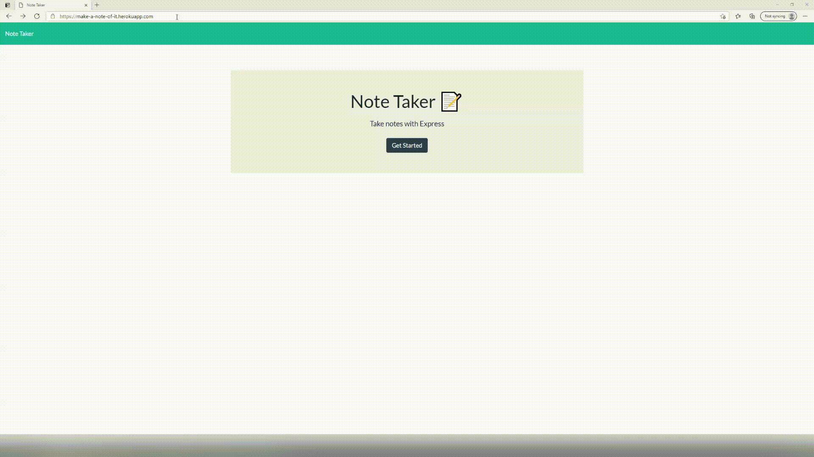

# Team Profile Generator

## Description 

*A summary of what this project is, and why it has been created:*

This website is built for an enduser to create notes and save them as a list and delete them once completed. <br> It is built using HTML, CSS & JavaScript and uses Node.js and Express.js.

<br>

[](https://opensource.org/licenses/MIT)

---

<br>


## Table of Contents       
   * [Installation](#installation)
   * [Usage](#usage)
   * [Contributing](#contributing)    
   * [Tests](#tests)    
   * [License](#license)
   * [Questions](#questions)
---

<br>

## Installation

*How to install this project:*

This project doesnt require installation to use it.

However you can either clone this repository to a local directory or you can fork this repository from within GitHub. Check out the [Contributing](#contributing) section if you wish to work on the project.

If you clone the project locally to work on you will need to install the dependencies, the project uses Node.js and Express.js, the dependancies can be installed by running ```npm install``` within the cloned directory using bash.

 
---

<br>

## Usage 

*How to use this project:*

The project is deployed using [Heroku](https://www.heroku.com/nodejs). <br> To access the site use the following link - the name of the project is: [make-a-note-of-it](https://make-a-note-of-it.herokuapp.com/). <br> On the landing page you need to click ```Get Started```. <br> <br>  <br> <br> The next screen is the Note recording page. Type a title in the ```Note Title``` area, then add a note in the ```Note Text``` area. A save icon will appear in the top right hand corner for you to then save the note, which will be then displayed on the left side of the page. <br> Notes can be deleted from the list by clicking their respective red bin (trash can 😀). <br> <br>  <br> <br> Below is a gif of the site demonstration: <br> <br> 


---

<br>

## Contributing

*If you like what you see and you would like to contribute, here's how you can:*

Contributing is welcome and easy. <br> If you like the project and feel you would like to either add to it or you would like to improve on it in anyway, please contact me via the [Questions](#questions) section below. <br> I will then be more than willing to give you access to collaborate. <br>You can also take a copy via the fork feature of GitHub and work on this project without collaboration if you wish.

 
---

<br>

## Tests

*Tests that have been run, and how to run them:*

The only tests carried out on this project are make a change, run the app, did it work? <br> ```Yes``` 😃 Woohoo! move on to the next section. <br> ```No```  🤔 Ok, gonna have to fix that to progress!


---

<br>

## License

*The following license has been applied to this project:*

MIT License - for more detail [Visit Site](https://opensource.org/licenses/MIT)


---

<br>

## Questions?

*For any questions regarding this project, please use either of the below contact details:*

GitHub: [@looosekonnection](https://github.com/looosekonnection)

Email: loosekonnection@gmail.com


---

<br>

## Copyright

© 2021 - Loosekonnection - Studying & working hard towards becoming a competent developer. 

